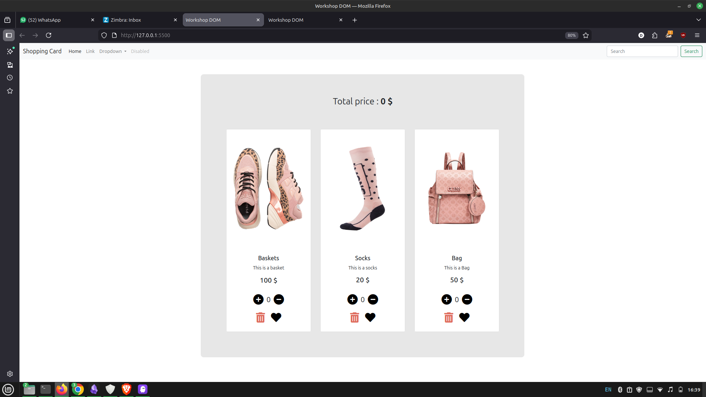

# DOM-Project-1

I added the JS functionality and also made some small changes in the index file since I wsa encountering and error where i could't access the css and assets when i open index.html but when I use live server, it works. So i removed the slash in the source paths.

## Instructions
You will create The JS needed for a shopping cart  to be fully fonctionnel

Instructions
Adjust the quantity of each item through  “+” and “-” buttons.
Delete items from the cart.
Like items through a clickable heart-shaped button that will change color accordingly.
See the total price adjusted according to quantity and deletions.
Use the CSS & the HTML provided HERE
Apply the necessary JS DOM Events to  ensure that we can :   
Adjust the quantity of each item through  “+” and “-” buttons.
Delete items from the cart.
Like items through a clickable heart-shaped button that will change color accordingly.
See the total price adjusted according to quantity and deletions.

